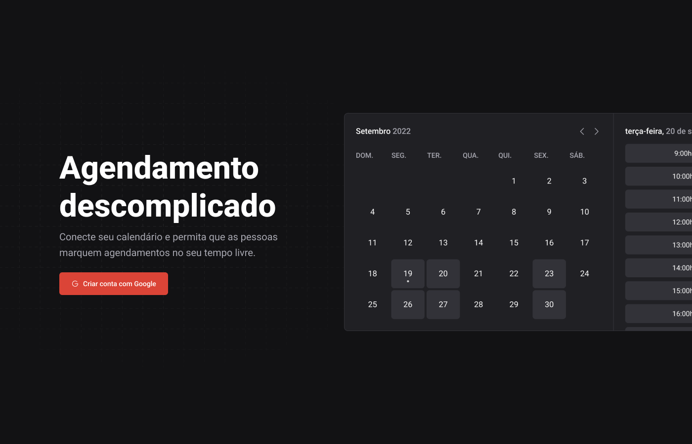
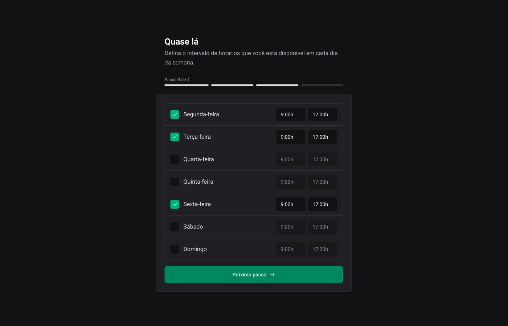
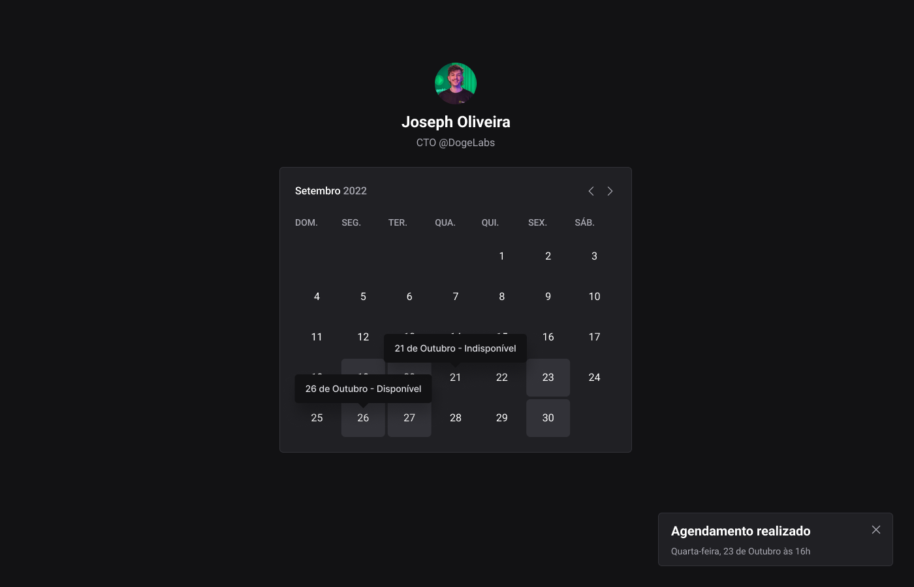

# Ignite Call

Neste projeto foi desenvolvido a plataforma de agendamento de videoChamadas Ignite Call, salvando os agendamentos no google Calendary.
Criando eventos, desta forma criando agendamentos de videochamadas, usando a plataforma google Meet para esse agendamento.

## Instalação

Baixe o projeto e rode os sequintes comandos abaixo.

Faça o git clone deste projeto.

Apos certifiquese que você tem o Node
instalado em sua máquina.

Caso não tenha o node ou prisma clique no link abaixo e faça a instação.

[nodejs](https://nodejs.org/en/download)
[prisma](https://www.prisma.io/)

apos siga os execute os dois comandos abaixo

```bash

  npm install
  npx prisma migrate dev
  npx prisma db push
  npm run dev

```

<h2>Tecnologias usadas</h2>
<ol>
    <li>TypeScript</li>
    <li>NextJS</li>
    <li>next-auth</li>
    <li>next-seo</li>
    <li>prisma</li>
    <li>react-query</li>
    <li>hookform/</li>
    <li>Zod</li>
    <li>dayjs</li>
</ol>

## Conheça o projeto

### Página Home



### Página 1 de Cadastro

   

### Página 3 de Cadastro de Hórarios

   

### Página de Calendario Para Agendamento

   
